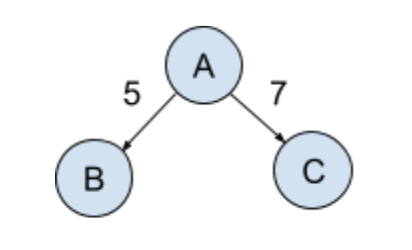

# Workflow Runner



## How to Run

- clone with git
- `npm install`
- `npm run dev`
- navigate to `http://localhost:5173/` or other port indicated by Vite in your terminal.
- Testing: `npm test`

## Description
A workflow runner that can accept the specification of a workflow in the form of a DAG represented in JSON where letters are assigned to the vertices and numbers are assigned to the edges. One node will be designated as the start vertex.

As the task runner traverses the graph, it should display the name of each visited node, starting from the start node. Then, for every edge emanating from a node, the runner should pause for a certain number of seconds before moving to the connected vertex. This pause duration corresponds to the number associated with the edge.

Note: The runner processes edges in parallel so that it starts the “timer” for each edge going out of a vertex at the same time after printing the vertex letter.

The runner should start by immediately printing A, then after 5 seconds print B, and then 2
seconds later print C. This graph, represented as JSON, would look something like:

```json
{
"A": {"start": true, "edges": {"B": 5, "C": 7}},
"B": {"edges": {}},
"C": {"edges": {}}
}
```

## Walkthrough

# Summary
A React UI for running the workflow runner on a DAG, along with some instructional links and example DAGs with different types of edges. Includes a graph with a cycle (not technically a DAG!) for instructional purposes.

# App.tsx

A component including a textarea form for user input, and a section that provides information about the task runner and how it traverses a graph.

Form: The form is used to submit JSON data that follows the Directed Acyclic Graph (DAG) pattern. 

Graph Examples: An expandable area shows example graphs to use in the form.

Upon submitting the form, the user provided JSON is validated for errors in the JSON itself, or for violations of the pattern. If an error in the JSON or the graph pattern is found, the user will receive a message in a red box below the form.

# GraphExample.tsx

A helper component to display a graph example, and populate the form with its JSON upon a button click.

# graph-utils.ts

Contains definitions of several example directed acyclic graphs (DAGs) and a function `printNodesWithDelays`. 

Example Graphs: used in tests, and to display some examples to the user in the UI. They are instructional with regards to the different types of edges that can occur in a DAG, or perhaps violate the DAG principle and contain a cycle.

`printNodesWithDelays`: This function traverses a graph in a depth-first manner, starting from a start node. It prints the name of each node it visits and the time elapsed since the start of the traversal in seconds. The traversal is delayed by a certain amount of time at each node. The function takes a graph object and a callback that the calling component passes to it, so the App component can update its state and display the node at the correct time.

Before starting the traversal, the function checks if the graph contains a cycle using the isCyclic function. If a cycle is detected, an error is thrown. This is because the function is designed to work with DAGs, which by definition cannot contain cycles.

# validation-util.ts

The `validateGraph` function checks if a given object follows the DAG pattern that is expected by the workflow runner. 

If it does not, the user will receive an error message describing the problem.

The `isCyclic` function checks if a graph contains a cycle, which would cause an infinite loop in the workflow runner. It uses a DFS traversal algorithm to detect a cycle.

# App.css
Styling for the UI using vanilla CSS.

# graph-utils.test.ts
Tests on the core depth-first traversal logic and wait times. Uses sinon to mock the clock and simulate the passage of time, and to fake the callback function passed to `printNodesWithDelays`

# validation-utils.ts
Tests for graph validation checking functions and the errors they throw.

# Future Improvement Ideas:
- Disable button while task runner is in progress. Will involve a mechanism for checking when all the timeouts are done. Perhaps a preprocessing step.
- Show a visualization of the graph as the task runner traverses it, [something similar to this.](https://visualgo.net/en/dfsbfs)
